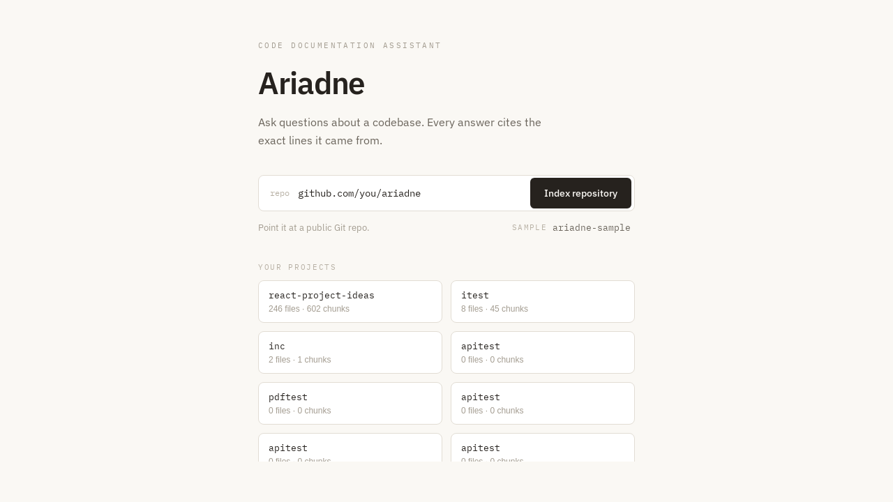
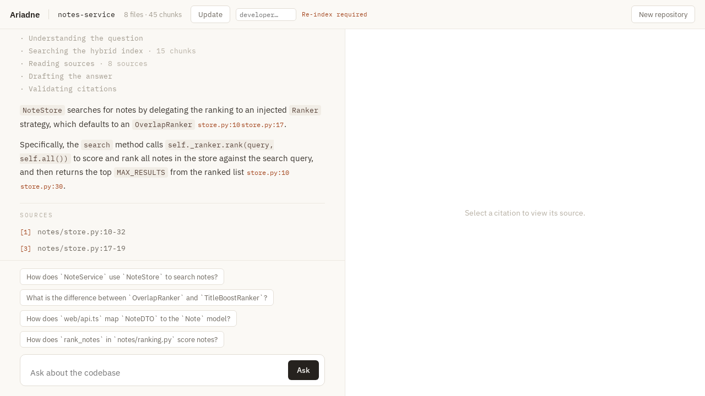
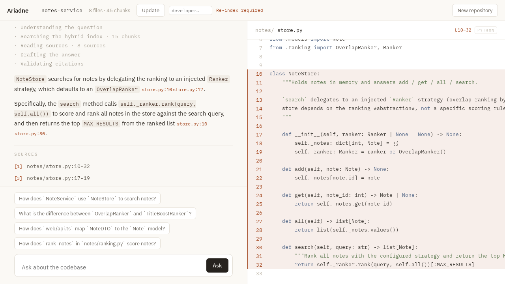

# Ariadne

A **code documentation assistant**: point it at a repository, ask questions in natural language,
and get answers where **every claim is cited to exact `path:line` ranges** you can click through to
the source. The product is *Ariadne* (the thread of trust between you and the code); the in-product
agent is *Daedalus* (the LangGraph graph that "built the labyrinth and knows every corner").

> **A note on this README.** The factual sections below describe what was built and verified.
> Section (i) — *Reflections* — is written in my own voice, as the assignment asks.
> Deep-dives live in [`docs/`](docs/); the decision log is [`docs/DECISIONS.md`](docs/DECISIONS.md).

---

## For reviewers (60-second demo)

No API key required — the default stack runs offline (local embedder + cassette replay).

```bash
cp .env.example .env
docker compose up --build
```

Wait for `seed` to finish (bundled `notes-service` ingest), then open **http://localhost:3000**:

1. Click **Sample → ariadne-sample** (opens the seeded repo)
2. Ask: *"How does NoteStore search for notes?"*
3. Click a `[n]` citation in the answer → source panel highlights the exact lines

Screenshots of this flow: [`docs/assets/`](docs/assets/). Demo video: [`docs/assets/demo.webm`](docs/assets/demo.webm)
(if present). To regenerate: `bash scripts/capture-screenshots.sh`.

**Live answers** (real Gemini): set `GEMINI_API_KEY` in `.env`, then
`EMBEDDING_PROVIDER=gemini` and `CASSETTE_MODE=off`, and restart compose.

**Full browser E2E** (real ingest + Gemini, ~5 min): `bash scripts/e2e.sh` (requires a key).

> **Note:** Your browser at **http://localhost:3000** must talk to **`http://localhost:8000`**
> (the default). `http://api:8000` only works *inside* the Docker network — it is set temporarily
> by `scripts/capture-screenshots.sh` and `scripts/e2e.sh`, then restored. If requests fail with
> `api:8000` in DevTools, run:
> `NEXT_PUBLIC_API_BASE=http://localhost:8000 docker compose up -d frontend`

---

## Screenshots

| Ingest | Chat + citations | Source panel |
|--------|------------------|--------------|
|  |  |  |

Demo walkthrough (optional): [demo.webm](docs/assets/demo.webm)

---

## (a) Setup

**Prerequisites:** Docker + Docker Compose. Works out of the box with **no API key** (offline demo).
Add a Gemini key only if you want live LLM answers.

```bash
cp .env.example .env          # defaults: EMBEDDING_PROVIDER=local, CASSETTE_MODE=replay
docker compose up --build     # api :8000 · frontend :3000 · postgres · qdrant · redis · worker
```

`migrate` applies the schema, `seed` ingests the bundled [`backend/sample_repo`](backend/sample_repo)
(a small polyglot `notes-service`) so the demo works immediately. Open **http://localhost:3000**, click
**Sample → ariadne-sample**, and ask "How does NoteStore search for notes?". A packaged
`backend/sample_repo.zip` is also provided for the upload flow (`scripts/pack-fixture.sh` regenerates it).

**Live mode** (real Gemini embeddings + synthesis):

```bash
# In .env: GEMINI_API_KEY=...  EMBEDDING_PROVIDER=gemini  CASSETTE_MODE=off
docker compose up --build
```

**Checks** (lint + types + deterministic tests + frontend):

```bash
bash scripts/run-checks.sh
# integration + eval gate (real Postgres+Qdrant, offline LLM via cassettes):
docker compose run --rm -e EMBEDDING_PROVIDER=local -e CASSETTE_MODE=replay api \
  sh -c "alembic upgrade head && pytest -m integration && python -m evals.run --check-thresholds"
```

## (b) Architecture

Hexagonal-lite + **Pipes & Filters** on two pipelines, with **LangGraph** for the query flow.
Full write-up + diagram: [`docs/DESIGN.md`](docs/DESIGN.md).

- **Ingest** (Taskiq worker): `clone/unzip → walk → tree-sitter chunk → embed(dense+sparse) → Qdrant + Postgres`.
- **Query** (LangGraph graph "Daedalus"): `embed → retrieve → fuse(RRF) → rerank → assemble → generate ⇄ critic`.

Ports (`typing.Protocol`) sit only on the **volatile IO boundaries** — embedder, sparse embedder,
generator, vector store, graph store, parser — so providers are swappable. The domain (`app/domain`)
is framework/LangChain/infra-free. LangChain is scoped to the **LLM only** (chat + embeddings); Qdrant
and Neo4j stay raw behind our ports so we control hybrid named-vectors, RRF, and collection-per-repo.
Multi-repo isolation flows through a `RepoContext` (repo_id → Qdrant collection + graph namespace), not
through class structure. `backend/app/` layout is documented in [`CLAUDE.md`](CLAUDE.md).

## (c) Productionizing

What this is **not** yet, and how I'd take it there:
- **State stores:** managed Postgres + Qdrant (and Neo4j when graph RAG lands); today they're local containers.
- **Multi-store consistency:** ingest writes Postgres + Qdrant; in prod a failure between them can drift.
  MVP relies on idempotent uuid5 retries; prod wants an **outbox + reconciliation** sweep.
- **Ingest at scale:** Taskiq already decouples the worker; add autoscaling, backpressure, and per-repo
  rate limits. Reranking moves to a GPU node (it's CPU-gated off by default here).
- **Secrets / multi-tenancy / auth:** none yet (out of scope). Add OIDC, per-tenant repo scoping (the
  `RepoContext` seam helps), and secret management.
- **Observability in the cloud:** OTel spans already exist — point the OTLP exporter at a collector;
  optionally enable LangSmith via env.

## (d) RAG / LLM approach

Details + rationale: [`docs/RAG.md`](docs/RAG.md). Highlights:
- **Chunking** is AST-aware (tree-sitter: Python/TS/JS), on function/class/method boundaries with a
  contextual prefix; unknown languages fall back to a recursive splitter so nothing is dropped.
- **Retrieval** is hybrid — dense (Gemini) + sparse (fastembed) as named vectors in one per-repo Qdrant
  collection — fused with **RRF** (no score-scale reconciliation), optional cross-encoder rerank.
- **Generation is a generator-critic loop.** The critic checks *citation-validity* deterministically
  (every `[n]` maps to a real source) and *faithfulness* via an LLM judge; it regenerates with feedback,
  then drops unsupported sentences, then refuses ("insufficient support"). Off-topic questions refuse via
  a `NO_ANSWER` sentinel. **All LLM access goes through LangChain.**
- **Prompts are first-class artifacts** (`app/prompts/`) — versioned, with explicit role/context/
  constraints/output_format and rationale; never inline f-strings.
- **Determinism:** a custom cassette layer records real LLM calls and replays them, so tests and the eval
  gate run offline and reproducibly.

## (e) Key decisions

The full ADR log is [`docs/DECISIONS.md`](docs/DECISIONS.md). The load-bearing ones: hexagonal-lite over
full DDD; LangChain scoped to the LLM while retrieval stays raw; Gemini for both embeddings + synthesis
(provider behind a port); Taskiq+Redis async ingest; generator-critic as the *only* agentic pattern in
MVP; cassettes + local embedder for a CI gate that actually bites; Neo4j designed-in (port + passthrough)
but not implemented.

## (f) Engineering standards — kept & consciously skipped

**Kept:** Definition-of-Done per feature (runs in compose, has a failing-without-it test, errors handled,
tradeoff logged). A real **testing standard** — behaviour/contract tests, positive + negative + adversarial
(prompt-injection, off-topic, empty retrieval), a test pyramid (unit mocks IO; integration hits real
Qdrant+Postgres and asserts retrieved chunks contain the expected symbols; evals score the full pipeline),
and *no green-washing* (a PreToolUse hook blocks tests whose every assertion is trivially true).

**Consciously skipped** (judgment, documented): full DDD aggregates/bounded-contexts, CQRS/Event-Sourcing,
a generic `Repository<T>`, the Specification pattern, an internal event bus, Sagas. On the agent side: of
the eight common multi-agent patterns, only **generator-critic** is in MVP; dispatcher + parallel
decomposition are deferred to the Neo4j graph phase; iterative-refinement / HITL / deep hierarchy are
omitted as over-engineering for a retrieve-and-answer system.

## (g) How AI tooling was used

Two harnesses (see [`docs/HARNESS.md`](docs/HARNESS.md)):
- **Dev-time** ([`.claude/`](.claude)): `CLAUDE.md` (always-loaded invariants), **hooks** that enforce what a
  model forgets (auto-format; block edits to secrets/lockfiles/applied migrations; **block green-washing
  tests**; TDD red-first; run fast tests on stop), **skills** (chunking, rag-pipeline, langgraph-nodes,
  prompt-authoring, qdrant-ops, harness-evals, testing), **commands** (`/new-endpoint`, `/new-node`,
  `/add-eval`, `/run-checks`), and a `reviewer` subagent.
- **Runtime** (in the product): typed graph state, the instrument decorator (OTel + structured `[daedalus]`
  logs), record/replay cassettes, the eval-runner, reusable guardrail steps, budgets/limits, and the
  `AgentRunner` facade — one code path shared by the API and the evals.

## (h) What I'd do differently / next

**Graph RAG is now implemented** (opt-in): a Neo4j call/contains graph + a `graph_augment` node that
enriches the top hits with structurally-related symbols, plus a keyword dispatcher that deepens
traversal for "who calls X"-style questions (`GRAPH_ENABLED=true` + `docker compose --profile graph up`).
Its resolution is name-based — the honest next step is a real symbol resolver (LSP/SCIP) to kill
same-name conflation, plus parallel query decomposition (LangGraph `Send`). Beyond that: incremental
re-indexing by git diff (file hashes already stored), the citation **hover-preview popover** (deferred —
click-to-open is implemented), evals against real Gemini embeddings, and a larger golden set with
regression tracking across prompt `VERSION`s.

## (i) Reflections

I chose Option 2 because citations are the product. Document RAG can hand-wave; a code assistant
has to point at real lines or it is useless. That `path:line` contract shaped every decision
downstream — AST chunking for boundaries, hybrid retrieval because symbol names matter as much as
semantics, and a generator-critic loop because I would rather refuse than invent a file reference.

The trade-off I am most aware of is scope versus depth. I kept the MVP narrow: ingest one repo,
answer with citations, ship in Docker. Graph augmentation, versioning, and authorship personas
rode on seams I had already cut (ports, `RepoContext`, versioned prompts), not on redesigns. I left
rerank off by default — it is CPU-heavy and retrieval was already acceptable on the sample repo —
and invested instead in determinism: cassettes, a local embedder, and an eval gate. A demo that
flakes in CI tells reviewers nothing.

What surprised me was how much of the hard work was not the LLM. Chunk boundary quality, hybrid
fusion without score-scale bugs, and citation validation in the critic mattered more than prompt
tweaking. The prompts are first-class artifacts, but the guardrails around them — empty-retrieval
refusal, fenced source blocks, adversarial tests — are what make the answers trustworthy.

On AI tooling: Claude Code with hooks and skills was a multiplier for boilerplate and for holding
standards I would otherwise forget mid-session. The PreToolUse hook that blocks green-washing tests
paid for itself the first time a model tried `assert True`. I do not paste architecture sections
from the model into the README; I use it to implement and test, then write the rationale myself.
Skills encode procedures (how to add a LangGraph node, how to structure a prompt module);
`CLAUDE.md` encodes invariants the model will violate if left unsupervised.

If I had another day, I would stop at the citation hover-preview and a zip-upload button in the UI —
polish that makes the citation loop feel instant — rather than more agent patterns. The assignment
says they want approach over complexity; I would rather reviewers spend ten minutes on a working
demo than reading about an orchestrator they cannot click.

---

🤖 Built with Claude Code. Backend `backend/` · Frontend `frontend/` · Design reference in
`Product Design Principles/`.
