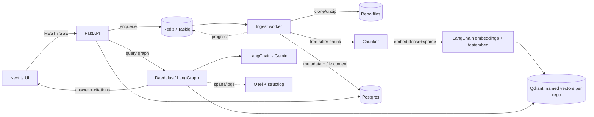

# Design

## Problem & scope
Ariadne ingests a code repository and answers natural-language questions about it, with every claim
cited to exact `path:line` ranges. See `SCOPE.md` for MVP/stretch/out-of-scope.

## Components

## Data flow
- **Ingest:** API creates a `repo` + `ingest_job`, enqueues a Taskiq task. The worker clones/unzips,
  walks (gitignore + deny-list), parses + chunks, embeds (dense via LangChain/Gemini, sparse via
  fastembed), upserts to a per-repo Qdrant collection, and persists file content + chunk metadata to
  Postgres. Progress is published to Redis and streamed to the UI (SSE).
- **Query:** API hands the question to the `AgentRunner` (Daedalus). The LangGraph graph embeds the
  query, retrieves hybrid candidates, fuses (RRF), optionally reranks, assembles a token-budgeted
  context, then runs the generator-critic loop and emits a streamed answer + validated citations.

## Data model
`repos`, `ingest_jobs`, `files (incl. content)`, `chunks`, `chat_sessions`, `messages`,
`eval_runs`, `eval_cases`. Vectors live in Qdrant; file content lives in Postgres so the UI's source
panel and hover popover can be served directly. (Full detail lands with the Phase 1 schema.)

## Boundaries & assumptions
- Hexagonal-lite: ports only on volatile IO; domain is framework-free. (`DECISIONS.md` D-002.)
- LangChain is scoped to LLM; retrieval is ours. (D-004.)
- Multi-repo isolation is by `repo_id` (RepoContext), not by class structure.

## Productionization
Forward-reference: managed Qdrant/Neo4j, GPU rerank, Taskiq autoscaling, outbox + reconciliation for
multi-store consistency, secrets management, cloud observability. Expanded in the root README (c).
